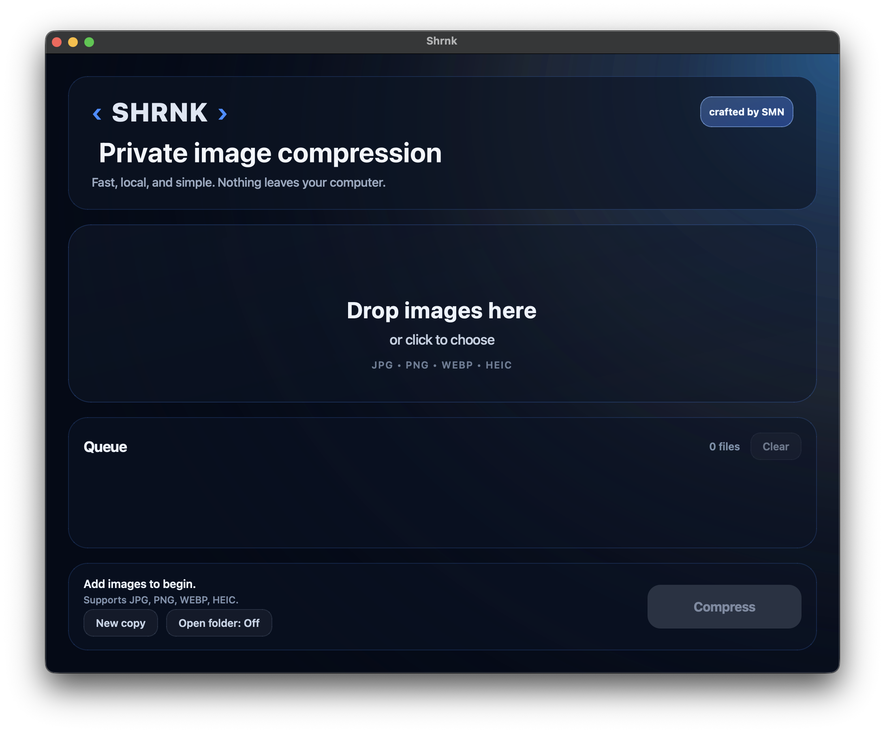

# Shrnk — Private Local Image Compression

  

Shrnk is a lightweight desktop application for local image compression, designed around three simple principles: speed, privacy, and simplicity.

All processing happens entirely on your machine. No uploads, no cloud processing, and no tracking.

## Download

Prebuilt binaries for macOS and Windows are available in the Releases section:

https://github.com/sepehrmhmdi/shrnk-demo/releases/latest

## Overview

Shrnk makes it easy to compress images in bulk through a clean drag-and-drop interface while preserving acceptable visual quality while significantly reducing file size in most common cases.

Supported formats:

* JPG / JPEG
* PNG
* WEBP
* HEIC / HEIF

Core features:

* Local offline compression
* Batch processing
* Drag-and-drop workflow
* Option to overwrite originals or create compressed copies
* Optional automatic opening of output folder after compression
* Minimal desktop interface

## Demo version

This repository contains the public demo version of Shrnk.

The demo is limited to **5 compressed images**, allowing users to test the application before purchasing the full version.

## Full version

The unrestricted version is available on Gumroad:

https://sepehrmn.gumroad.com/l/shrnk

## Security notes

Shrnk is currently distributed as an unsigned desktop application.

Because it is independently distributed and not code-signed yet, your operating system may display a security warning on first launch.

### macOS

To open:

1. Right click the application
2. Select **Open**
3. Confirm again

or:

**System Settings → Privacy & Security → Open Anyway**

### Windows

If SmartScreen appears:

1. Click **More info**
2. Select **Run anyway**

This is standard behavior for unsigned independent desktop software.

## Privacy

Shrnk does not transmit files, collect analytics, or process any user data remotely.

Everything remains entirely local on your machine.

## Author

Created by SMN
